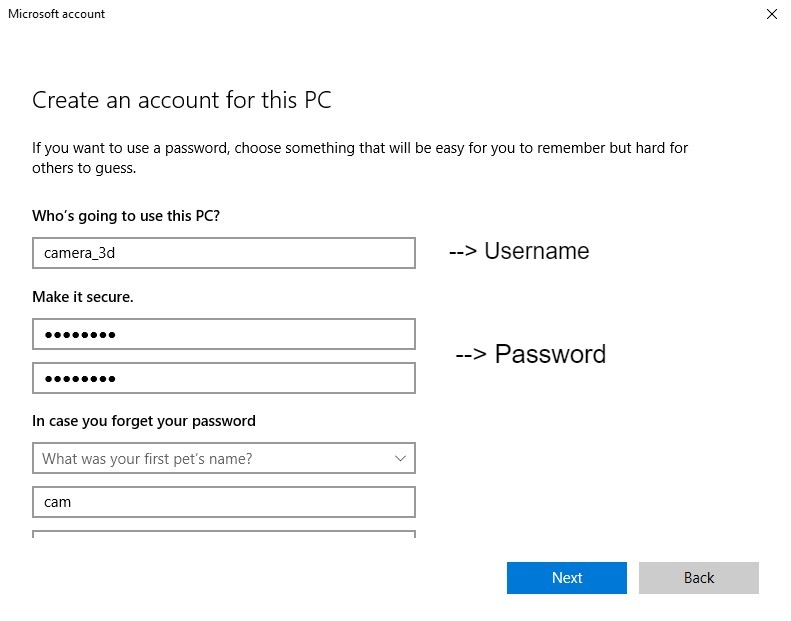

## FTP SERVER
___
### Langkah-Langkah untuk Membuat FTP Server :
1. __Buatlah akun untuk FTP Server dengan cara :__
   - Masuk ke _menu Setting -> Account -> family & other people -> add someone else to this PC_.
   - Pilih _i dont have this person's sign-in information -> Next_.
   - Pilih _add a user without a microsoft account -> Next_.
   - Isi ___Username dan Password___ -> _Next_. 

   Untuk lebih jelasnya silahkan lihat gambar dibawah ini :

    

2. __Install Internet Information Services (IIS) dengan cara :__
   - Masuk ke _menu Control Panel_ (Ubah bagian _view by category_ menjadi _small icons_)
   - Masuk _menu Programs and Features -> turn windows features on or off_ .
   - Centang pada bagian _Internet Information Services_ . 

   Untuk lebih jelasnya silahkan lihat gambar dibawah ini :

   

   - Jika sudah sesuai dengan gambar lalu klik OK.

3. Setelah IIS terinstall selanjutnya masuk pada menu ___Control Panel -> Administrative Tools -> Open Internet Information Services (IIS)___.

4. Klik kanan pada bagian sites lalu ___klik Add FTP Site...___ (Seperti gambar dibawah ini).

   

5. ___Setting FTP Site_ dengan mengikuti langkah berikut ini :__

   - Isi kolom _FTP site name_ dengan nama sesuai keinginan/kebutuhan.
   - Isi kolom _physical path_ dengan memilih Folder FTP sebagai penyimpanan server dengan __klik tanda ... -> pilih Folder -> OK__. 
   
     (Seperti gambar dibawah ini)

    
   
    - Jika Folder FTP belum dibuat (__Arahkan ke tempat penyimpanan sesuai keinginan -> Klik _Make New Folder_ -> Beri Nama Folder FTP -> OK__).

   Maka tampilan _setting site informatin_ akan seperti gambar dibawah ini :

    

   - Jika sudah sesuai klik _Next_.
   - __Isi _binding_ sesuai dengan _IP Address PC___ masing-masing ( __Windows+R -> Ketik cmd -> OK -> Ketik ipconfig__ ).

   Berikut ini adalah contoh _ip address_ yang digunakan :

    
   - __Isi bagian SSL dengan No SSL__ .

   Maka tampilan _Binding and SSL Setting_ akan seperti gambar dibawah ini :

    

   - Jika sudah sesuai klik _Next_ .
   - isi bagian _authentication dan authorization_ .
   
   Isi bagian _authentication dan authorization_ dengan mengikuti gambar dibawah ini :

    

   - __Pada bagian _Allow acces_ pilih _specified users_ dan isi dengan _username___ akun yang sudah dibuat.
   - Pada bagian permission tergantung dengan kebutuhan masing - masing jika diizinkan untuk _read_ dan _write_ maka centang keduanya.
   - klik _finish_.

6. __Setting Firewall dengan cara :__
   - Masuk ke menu ___Control Panel -> Windows Defender Firewall -> Allow an app on feature through Windows Defender Firewall_ -> Klik _Change Setting_ -> centang _FTP Server, private_ dan _public___.

   Untuk lebih jelasnya silahkan lihat gambar dibawah ini :

    

   - Jika sudah sesuai klik OK.

7. __Setting security Folder FTP dengan cara :__
   - Klik kanan _Folder FTP -> Properties -> Menu Security -> Edit -> Add_.
   - __Isi pada kolom _Enter The Object Names to Select_ dengan _Username___ -> klik _Check Names_. 

   Untuk lebih jelasnya silahkan lihat gambar dibawah ini :
    
    

  
   - Jika sudah sesuai maka klik OK
   - _Edit_ pada bagian _permissions_ dengan mencentang bagian _Allow full control_.

   Untuk lebih jelasnya silahkan lihat gambar dibawah ini :

    

   - Klik _Apply -> OK_ .

8. __Testing server FTP dengan cara :__
   - Buka chrome lalu __ketik ftp://(_ip address_) -> isi _Username_ dan _Password___. Jika tidak bisa maka :

     _Search chrome://flags -> search temporarily unexpire M91 flags_ pilih _enabled_ -> Klik _Relaunch_ -> Masuk kembali ke _chrome -> Search chrome://flags -> search enable support for ftp URLs_ pilih _enabled_ -> Klik _Relaunch_ -> ketik kembali ftp yang akan dituju.

    

    - Atau bisa juga melalui _Filezilla client_ dengan mengisi _ip address, username, dan password_. Link Download FTP Client : https://filezilla-project.org/.
    - Jika server ftp sudah berhasil maka tampilannya akan seperti berikut ini :

    

